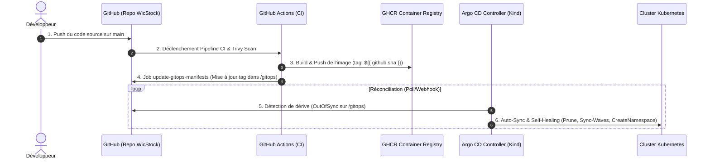

# 🧵 WicStock - Smart Textile Inventory Management & Optimization Platform

> Academic / internship project focused on intelligent textile inventory management, AI-assisted analytics, multi-agent systems, and real-time operations.

[](https://github.com/HaifaCheikh/WicStockProject/actions/workflows/ci.yml)
[](https://dotnet.microsoft.com/)
[](https://dotnet.microsoft.com/apps/aspnet/web-apps/blazor)
[](https://fastapi.tiangolo.com/)
[](https://argoproj.github.io/cd/)
[](https://kubernetes.io/)
[](https://helm.sh/)
[](https://ollama.com/)
[](https://www.trychroma.com/)
[](https://learn.microsoft.com/ef/core/)
[](https://dotnet.microsoft.com/apps/aspnet/signalr)

---

## 📊 Overview

**WicStock** is an intelligent web-based platform tailored for the textile manufacturing and retail industry. Built with a primary focus on **waste reduction**, **circular economy**, and **stock optimization**, it helps textile businesses minimize financial loss caused by unsold garments and overproduction.

By leveraging **predictive risk analytics and AI-assisted recommendations**, WicStock anticipates stock shortages, obsolescence, and overstock scenarios, automatically suggesting mitigation strategies (e.g., flash discounts, B2B redistribution, or fabric recycling).

The application is architected as a **full-stack monorepo** featuring:
- **ASP.NET Core Web API (.NET 8)** backend
- **Blazor WebAssembly** frontend
- **FastAPI Multi-Agent AI Service (Python 3.10+)** for RAG, NL2SQL, and interactive AI analytics

---

## 🧩 Key Features & Modules

### 1. Smart Stock Analytics & AI Assistant
* **Natural Language to SQL (NL2SQL)**: Ask inventory questions in natural language and get real-time SQL execution results.
* **Interactive Data Visualization**: Automatic generation of dynamic charts.
* **Overstock & Shortage Risk Scoring**: Automatic detection of slow-moving inventory, holding cost estimation, and lifecycle risk alerts.
* **Intelligent Action Plans**: AI-assisted recommendations to apply promotional markdowns, trigger recycling workflows, or reallocate excess fabric.

### 2. Role-Based BI Dashboards
* **Admin & Manager Dashboards**: High-level KPI visualization, interactive charts (Category Breakdown, Monthly Sales, Stock Health).
* **Role-Based Access Control (RBAC)**: Custom views and permission sets for `Admin`, `Manager`, `Client`, and `Delivery`.

### 3. Catalog & Order Lifecycle (Standard & Made-to-Order)
* **Dynamic Product Catalog**: Filtering by category, fabric type, promotion status, and custom stock availability.
* **Made-to-Order Pipeline (*Sur-Commande*)**: End-to-end workflow for pre-orders and personalized client specifications.

### 4. Payment Gateway Integration
* **LemonSqueezy Integration**: Secure checkout sessions, variant-based pricing, and automatic order confirmation webhooks.

### 5. Logistics & Delivery Tracking
* **Delivery Board**: Dedicated tracking interface for delivery agents and managers.
* **Customer Order Tracker**: Step-by-step progress stepper (*Confirmed -> In Preparation -> In Transit -> Delivered*).

### 6. Real-Time SignalR Notifications
* **Live Notifications**: Instant push notifications for critical alerts, delivery status changes, and new reviews without page refresh.
* **Interactive Notification Bell**: Unread counters and quick mark-as-read functionality.

---

## 🤖 Multi-Agent AI Architecture

The `ai-service` runs on a **4-agent decision layer**, backed by a security guard and two internal services - all coordinated by a central orchestrator:

```
                            User Query
                                 |
                       +-------------------+
                       | OrchestratorAgent |
                       +-------------------+
                                 |
          +----------------------+----------------------+
          v                      v                      v
+-------------------+  +-------------------+  +-------------------+
|    NL2SQLAgent    |  |   SurstockAgent   |  |  PreferenceAgent  |
+-------------------+  +-------------------+  +-------------------+
          v                      v                      v
+-------------------+  +-------------------+  +-------------------+
|   SQLGuardAgent   |  |SurstockDataFetcher|  |   ChartBuilder    |
+-------------------+  +-------------------+  +-------------------+
          |
          v
     SQL Server
```

`OrchestratorAgent` routes each request; `NL2SQLAgent`, `SurstockAgent`, and `PreferenceAgent` handle SQL generation, overstock diagnostics, and chart customization respectively; `SQLGuardAgent` enforces SELECT-only validation and RBAC before touching `SQL Server`.

---

## 🛠️ Technology Stack

| Layer | Technologies & Tools |
|---|---|
| **Backend** | ASP.NET Core Web API (.NET 8), Entity Framework Core, SQL Server (LocalDB / Azure SQL) |
| **Frontend** | Blazor WebAssembly (.NET 8), MudBlazor, Custom Modern CSS & Glassmorphism UI |
| **AI Microservice** | Python 3.10+, FastAPI, 4-Agent Architecture, Ollama (Qwen3:1.7b), ChromaDB RAG, pyodbc |
| **Realtime** | ASP.NET Core SignalR WebSockets |
| **Security** | JWT (JSON Web Tokens), Role Authorization, Cloudflare Turnstile Bot Protection |
| **Integrations** | LemonSqueezy Payments API, WhatsApp Service API |

---

## 📁 Repository Structure

```
WicStockProject/
|-- backend/              # ASP.NET Core Web API (.NET 8)
|-- frontend/             # Blazor WebAssembly client application
|-- ai-service/           # FastAPI AI Microservice (4 Multi-Agents + ChromaDB + Ollama)
|   |-- app/              # FastAPI application, agents, guards, and services
|   |-- data/             # SQL schema descriptions and example queries
|   `-- requirements.txt  # Python dependencies
|-- WicStock.sln          # Unified Visual Studio Solution
|-- .gitignore            # Git exclusion rules
`-- README.md             # Project documentation
```

---

## 🚀 Getting Started

### 1. Prerequisites
* [.NET 8.0 SDK](https://dotnet.microsoft.com/download/dotnet/8.0)
* [Python 3.10+](https://www.python.org/downloads/) & [Ollama](https://ollama.com/) (with `qwen3:1.7b` & `nomic-embed-text`)
* [SQL Server](https://www.microsoft.com/sql-server/) (or SQL Server LocalDB with Visual Studio 2022)
* [ODBC Driver 17 for SQL Server](https://learn.microsoft.com/en-us/sql/connect/odbc/download-odbc-driver-for-sql-server)

---

### 2. Clone the Repository

```bash
git clone https://github.com/HaifaCheikh/WicStockProject.git
cd WicStockProject
```

---

### 3. Backend Setup (.NET API)

```bash
cd backend

# Configure environment settings
cp appsettings.Example.json appsettings.json

# Restore packages and apply database migrations
dotnet restore
dotnet ef database update

# Run the API
dotnet run
```
> The API will start on `https://localhost:7179` (or `http://localhost:5042`).

---

### 4. AI Microservice Setup (FastAPI)

In a new terminal:

```bash
cd ai-service

# Create and activate Python virtual environment
python -m venv venv
.\venv\Scripts\Activate.ps1   # PowerShell on Windows
# source venv/bin/activate    # Linux / macOS

# Install dependencies
pip install -r requirements.txt

# Start the FastAPI AI service
uvicorn app.main:app --reload --port 8001
```
> The AI microservice will start on `http://localhost:8001`.
> Interactive API documentation (Swagger UI) is available at `http://localhost:8001/docs`.

---

### 5. Frontend Setup (Blazor)

In another terminal window:

```bash
cd frontend

# Restore packages and run Blazor client
dotnet restore
dotnet run
```
> The web application will be accessible at `https://localhost:7121` (or `http://localhost:5043`).

---

## 🐳 Containerisation & Pipeline CI/CD

WicStock intègre une chaîne d'intégration et de déploiement continu complète (CI/CD) et containerisée :

### 1. Docker & Docker Compose
- **Backend API (.NET 8)** : Multi-stage build optimisé (`backend/Dockerfile`).
- **Frontend WebAssembly (Blazor)** : Compilation & distribution via serveur Nginx web (`frontend/Dockerfile`).
- **Services locaux** : Orchestration via `docker-compose.yml` (API, Frontend, SQL Server / PostgreSQL, Prometheus, Grafana, Microservices IA & WhatsApp).

### 2. Pipelines GitHub Actions
- **CI (`.github/workflows/ci.yml`)** : Se déclenche à chaque `push` ou `pull_request` sur `main`. Effectue le build .NET du backend, du frontend Blazor, la validation du microservice Python et la vérification des builds Docker.
- **CD (`.github/workflows/deploy.yml`)** : Publie automatiquement l'application après succès des builds CI.

### 3. Déploiement Cloud
- **Frontend** : Hébergé sur **Vercel** (`vercel.json`) avec routage Single Page Application (SPA).
- **Backend API & Base de données** : Hébergés sur **Render.com** (`render.yaml`) avec base PostgreSQL.

---

## 🔭 Observabilité & Monitoring

Le backend API inclut une suite d'observabilité professionnelle conforme aux normes cloud-native :

### 1. HealthChecks (Santé du service & dépendances)
L'API expose des endpoints de santé au format JSON avec horodatage et durées d'exécution :
- **Liveness** (`GET /health/live`) : Vérifie que le processus API répond (Requis pour le *Health Check Path* sur Render.com et Kubernetes).
- **Readiness** (`GET /health/ready` ou `/health`) : Vérifie l'API ET la connectivité effective à la base de données (`AppDbContext`).

### 2. Logging Structuré avec Serilog & Correlation ID
- **Format JSON Structuré** : Production de logs au format `CompactJsonFormatter` en console.
- **Correlation ID** : Chaque requête génère ou propage l'en-tête `X-Correlation-Id`, permettant le suivi bout en bout des requêtes distribuées.
- **Contextualisation** : Inclusion automatique des paramètres HTTP (route, status code, latence en ms, IP client).

### 3. Métriques Prometheus & Dashboard Grafana
- **Endpoint Metrics** (`GET /metrics`) : Exporte les métriques système .NET et les métriques HTTP au format standard Prometheus.
- **Métrique Custom** : `wicstock_products_total` (suivi du nombre de produits actifs en catalogue) et `wicstock_ai_requests_total`.
- **Tableau de bord Grafana préconfiguré** : Auto-provisionné au démarrage sur `http://localhost:3000`. Les identifiants sont définis via le fichier `.env` (voir `.env.example`, non versionné — aucun identifiant en dur dans le code).

```
+------------------+         Scrape /metrics        +-------------------+
|  WicStock API    | <---------------------------- |    Prometheus     |
| (ASP.NET Core 8) |                                |   (Port 9090)     |
+------------------+                                +-------------------+
         |                                                    |
         | Health checks                                      v
         v                                          +-------------------+
/health/live & /health/ready                        |      Grafana      |
  (Render.com / K8s)                                |   (Port 3000)     |
                                                    +-------------------+
```

### 🧪 Guide de Test Local

```bash
# 1. Copier et personnaliser les variables d'environnement (obligatoire)
cp .env.example .env
# Editez .env pour choisir vos identifiants Grafana

# 2. Lancer la stack complète avec Monitoring
docker-compose up --build
```

> **🔒 Gestion des secrets** : Les identifiants Grafana sont chargés depuis le fichier `.env` (non versionné). Copiez `.env.example` vers `.env` et personnalisez les valeurs — aucun identifiant ne doit apparaître dans Git.

**Endpoints à tester :**
- **Liveness API** : `http://localhost:8080/health/live`
- **Readiness DB** : `http://localhost:8080/health/ready`
- **Métriques Prometheus** : `http://localhost:8080/metrics`
- **Prometheus UI** : `http://localhost:9090`
- **Grafana Dashboard** : `http://localhost:3000` (identifiants définis dans votre `.env`) → *WicStock API Observability Dashboard*.

---

## 🛡️ Sécurité & DevSecOps

WicStock intègre une suite de protections **DevSecOps automatisées** 100% cloud-native et intégrées au workflow GitHub :

| Outil DevSecOps | Champ d'Application | Fréquence & Déclencheur | Canal de Remontée |
|---|---|---|---|
| **Dependabot** | Dépendances NuGet, Pip, npm, Docker & GitHub Actions | Hebdomadaire (`weekly`) | Pull Requests (Groupées) & Security Tab |
| **CodeQL (SAST)** | Analyse statique du code source C# (Backend API & Frontend Blazor) | Push, PR & Cron (Lundi 03:00 UTC) | GitHub Security > Code scanning |
| **Trivy (Container Scan)** | Vulnérabilités (CRITICAL, HIGH) des 4 images Docker (`api`, `web`, `ai`, `whatsapp`) | CI Pipeline (`trivy-scan`) | GitHub Security SARIF & Logs CI |
| **Branch Protection** | Branche `main` protégée (PR obligatoire & validation des checks CI/CodeQL/Trivy) | En continu | Règles GitHub Repository |

### 🔍 Détails des Protections DevSecOps
1. **Dependabot** : Mises à jour automatisées par écosystème avec règles `ignore` sur les versions majeures des SDKs critiques (`.NET SDK 8→10`, `Python 3.11→3.14`, `Node 20→26`) afin d'éviter les ruptures en production.
2. **CodeQL** : Détection des vulnérabilités de code (injection SQL, failles d'autorisation, fuites de données) directement dans l'interface Security de GitHub.
3. **Trivy Scanner** : Inspecte le système de fichiers et les packages OS des images Docker construites en CI. Les rapports au format SARIF centralisent toutes les alertes au même endroit.
4. **Politique de Protection `main`** : Interdiction des pushs directs et obligation de passer l'ensemble des validations de sécurité avant intégration.

### ⚠️ Risques Résiduels Connus & Contexte d'Architecture (ChromaDB)
- **Analyse de la Surface d'Attaque** : Les vulnérabilités signalées par Dependabot sur ChromaDB (ex: isolation multi-tenant, injection de code via serveur HTTP distant) concernent le serveur HTTP indépendant de ChromaDB lorsqu'il est exposé publiquement sur un réseau non sécurisé.
- **Mitigation par l'Architecture WicStock** :
  - ChromaDB est utilisé en **mode embarqué persistant local** (`chromadb.PersistentClient`), enfermé dans le conteneur privé `ai-service`.
  - Le port ChromaDB n'est **jamais exposé sur Internet** ni accessible par des utilisateurs externes.
  - L'application fonctionne en **mono-tenant**, éliminant les risques de fuite inter-tenants.
  - La version de ChromaDB a été mise à jour vers la version **1.5.9** (dernière version stable sur PyPI).

---

## ☸️ Architecture Kubernetes & Package Manager Helm

WicStock dispose d'une infrastructure **Kubernetes native** organisée par **namespaces modulaires à la demande** et gérée par **Helm 3**. Cette architecture permet de minimiser l'empreinte mémoire RAM/CPU en développement local tout en garantissant des profils de production scalables.

### 🏢 1. Découpage par Namespaces Modulaires
| Namespace | Composants | Description & Stratégie Dev |
|---|---|---|
| **`wicstock-core`** | PostgreSQL + Backend API + Frontend Blazor + Ingress | **Socle quotidien** : toujours allumé (~288Mi RAM) |
| **`wicstock-ai`** | Microservice IA FastAPI + Vectorstore ChromaDB | **À la demande** : allumé uniquement pour tester les fonctions IA (~256Mi RAM) |
| **`wicstock-observability`** | Prometheus + Grafana | **À la demande** : allumé pour démo/métriques (~192Mi RAM) |

> **🔒 Sécurité des Secrets Kubernetes** : Sur d'anciens environnements de démo, les secrets peuvent être initialisés via des manifests. Pour la production ou un dépôt public, les secrets sont injectés dynamiquement via `kubectl create secret` ou un gestionnaire externe (*Sealed Secrets*, *External Secrets Operator* / Vault). Aucun secret de production n'est committé en clair.

### 📊 2. Profils de Ressources & Limites (`resources.requests/limits`)
| Composant | Profil Dev (Requests / Limits) | Profil Prod (Requests / Limits) | Health Probes (Liveness / Readiness) |
|---|---|---|---|
| **PostgreSQL** | `50m / 250m` CPU · `128Mi / 256Mi` RAM | `250m / 1000m` CPU · `512Mi / 2Gi` RAM | `pg_isready -U wicstock_user -d wicstock_db` |
| **Backend API** | `50m / 300m` CPU · `128Mi / 256Mi` RAM | `200m / 1000m` CPU · `512Mi / 1Gi` RAM | `GET /health/live` & `GET /health/ready` (port 8080) |
| **Frontend Blazor** | `20m / 100m` CPU · `32Mi / 64Mi` RAM | `50m / 250m` CPU · `128Mi / 256Mi` RAM | `GET /` (port 80) |
| **AI Service (FastAPI)** | `100m / 500m` CPU · `256Mi / 768Mi` RAM | `500m / 2000m` CPU · `1Gi / 4Gi` RAM | `GET /health` (port 8000) |
| **Prometheus** | `50m / 200m` CPU · `128Mi / 256Mi` RAM | `200m / 1000m` CPU · `512Mi / 2Gi` RAM | `emptyDir` (dev) vs `PVC` + 15d (prod) |
| **Grafana** | `20m / 100m` CPU · `64Mi / 128Mi` RAM | `100m / 500m` CPU · `256Mi / 512Mi` RAM | `GET /api/health` (port 3000) |

### 🛠️ 3. Guide de Démarrage Rapide Kubernetes (kind)

```bash
# 1. Créer le cluster kind (2 nœuds : 1 control-plane + 1 worker avec ports 80/443)
kind create cluster --config k8s/kind-config.yaml

# (Optionnel : cluster 3 nœuds pour démo multi-nœuds / screenshots)
# kind create cluster --config k8s/kind-config-demo.yaml

# 2. Installer NGINX Ingress Controller
kubectl apply -f https://raw.githubusercontent.com/kubernetes/ingress-nginx/main/deploy/static/provider/kind/deploy.yaml
kubectl wait --namespace ingress-nginx --for=condition=ready pod --selector=app.kubernetes.io/component=controller --timeout=120s

# 3. Lancer le socle quotidien wicstock-core (Postgres + API + Frontend)
kubectl apply -f k8s/manifests/wicstock-core/

# 4. (Optionnel) Lancer le module IA et/ou Observabilité à la demande
kubectl apply -f k8s/manifests/wicstock-ai/
kubectl apply -f k8s/manifests/wicstock-observability/

# 5. Script d'administration interactif (Bash ou PowerShell)
./k8s/manage.sh status     # PowerShell: .\k8s\manage.ps1 status
./k8s/manage.sh top        # Consommation CPU / RAM en temps réel
```

> **💡 Note d'accès sous Windows / Kind** : Selon la configuration réseau Docker Desktop / WSL2, l'accès local aux services Ingress ou Grafana / Prometheus peut s'effectuer via `kubectl port-forward` (ex: `kubectl port-forward svc/grafana-service 3000:3000 -n wicstock-observability`).


### ☸️ 4. Déploiement via Helm 3 (`helm/wicstock`)

```bash
# Déploiement du Chart Helm en profil Dev (Ultra-Léger)
helm install wicstock ./helm/wicstock --set resources.profile=dev

# Déploiement en profil Prod (Ressources élevées + Persistence PVC)
helm install wicstock-prod ./helm/wicstock --set resources.profile=prod --set environment=prod
```

---

## 🔄 GitOps avec Argo CD & Bitnami Sealed Secrets

WicStock met en œuvre une architecture **GitOps déclarative et sécurisée (Pull-based)** avec **Argo CD** et **Bitnami Sealed Secrets** sur Kubernetes :



### 🧠 1. Modèle Push-Based (Ancien) vs Pull-Based GitOps (Nouveau)
- **Modèle Push-Based (CI/CD classique)** : La CI exécute `kubectl apply` ou ssh vers le cluster. Nécessite d'exposer les accès et credentials administrateur du cluster à la CI (risque de sécurité).
- **Modèle Pull-Based GitOps (Argo CD)** : Le cluster est autonome. Un contrôleur interne (**Argo CD**) scrute en continu le dépôt Git (déclaré comme **Source Unique de Vérité**). Aucun identifiant du cluster n'est exposé à l'extérieur.

### 🛡️ 2. Gestion des Secrets avec Bitnami Sealed Secrets
- **Secrets Scellés Chiffrés** : Les fichiers `SealedSecret` sont chiffrés asymétriquement par `kubeseal` et versionnés dans Git sans risque.
- **Déchiffrement In-Cluster** : Seul le contrôleur **Sealed Secrets** hébergé dans le namespace `kube-system` possède la clé privée maître pour restaurer le secret natif Kubernetes.

### 🛠️ 3. Guide d'Accès à l'UI Argo CD en Local

```powershell
# 1. Ouvrir le port-forward local sécurisé
.\k8s\manage.ps1 start-argocd-ui

# 2. Récupérer le mot de passe admin initial
.\k8s\manage.ps1 get-argocd-pass

# Accès Web UI : https://localhost:8443 (Utilisateur : admin)
```

> **📌 Séparation des Environnements** : Argo CD et le cluster Kind local servent de démonstration de compétences DevOps avancées. Les hébergements de production existants (Vercel, Render.com) demeurent indépendants et opérationnels.

---

## 📄 License

This is an academic/internship project developed for educational and demonstration purposes. No commercial license is granted.


