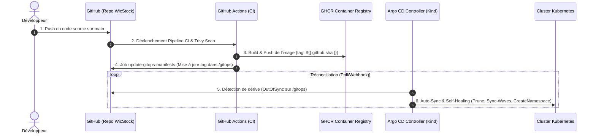

# 🔄 GitOps avec Argo CD & Bitnami Sealed Secrets

WicStock met en œuvre une architecture **GitOps déclarative et sécurisée (pull-based)** avec **Argo CD** et **Bitnami Sealed Secrets** sur Kubernetes.



## 1. Push-based vs Pull-based GitOps

| Modèle | Fonctionnement | Risque |
|---|---|---|
| **Push-based (CI/CD classique)** | La CI exécute `kubectl apply` ou se connecte en SSH au cluster | Nécessite d'exposer les accès/credentials admin du cluster à la CI |
| **Pull-based (Argo CD)** | Le cluster est autonome ; un contrôleur interne (Argo CD) scrute en continu le repo Git, déclaré comme source unique de vérité | Aucun identifiant du cluster n'est exposé à l'extérieur |

## 2. Gestion des secrets avec Bitnami Sealed Secrets

- **Secrets scellés chiffrés** : les fichiers `SealedSecret` sont chiffrés asymétriquement via `kubeseal` et peuvent être versionnés dans Git sans risque.
- **Déchiffrement in-cluster** : seul le contrôleur Sealed Secrets (namespace `kube-system`) possède la clé privée pour restaurer le secret natif Kubernetes.

## 3. Accès à l'UI Argo CD en local

```powershell
# 1. Ouvrir le port-forward local
.\k8s\manage.ps1 start-argocd-ui

# 2. Récupérer le mot de passe admin initial
.\k8s\manage.ps1 get-argocd-pass

# Accès : https://localhost:8443 (utilisateur : admin)
```

> 📌 **Séparation des environnements** : Argo CD et le cluster kind local servent de démonstration de compétences DevOps avancées. Les hébergements de production existants (Vercel, Render.com) restent indépendants et opérationnels — voir [`hosting.md`](hosting.md).

---

⬅ [Back to README](../README.md)
